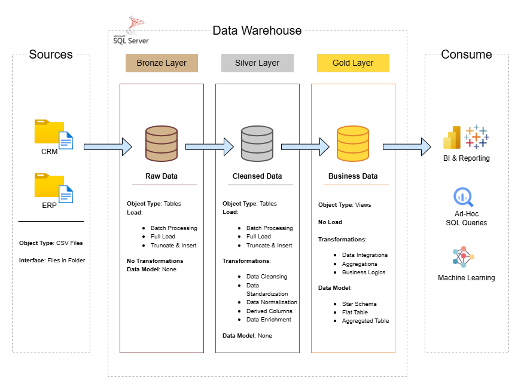

# 📦 Data Warehouse and Analytics Project

Welcome to the **SQL Data Warehouse and Analytics Project** repository!   
This project demonstrates a complete end-to-end data warehousing and analytics solution — from ingesting raw data to generating meaningful insights. Designed as a **portfolio project**, it showcases practical skills in **SQL, Data Engineering, ETL, and Analytics**.

---

## 🏗️ Data Architecture

This project follows the **Medallion Architecture** consisting of three layers:



### 🥉 Bronze Layer  
- Stores raw data directly from CSV files  
- No transformations applied  

### 🥈 Silver Layer  
- Data cleaning, validation, and standardization  
- Fixing duplicates, inconsistent values, and missing data  

### 🥇 Gold Layer  
- Business-ready **Star Schema** (Fact & Dimension tables)  
- Optimized for analytics and reporting  

---

## 📖 Project Overview

This project covers:

- **Data Architecture** using Medallion pattern  
- **ETL Pipelines** using SQL (Extract → Transform → Load)  
- **Data Modeling** (Star Schema in the Gold layer)  
- **Analytics & Reporting** using SQL insights  

Demonstrated skills:

- SQL Development  
- Data Engineering  
- ETL Pipeline Development  
- Data Modeling  
- Data Analysis  

---

## 🛠️ Tools Used

All tools in this project are free:

- SQL Server Express  
- SQL Server Management Studio (SSMS)  
- GitHub  
- Draw.io
- Notion 
- CSV datasets  

---

## 🚀 Project Requirements

### **1. Data Warehouse (Data Engineering)**

**Objective:**  
Build a SQL-based data warehouse combining CRM and ERP data.

**Key Tasks:**
- Import CSV files from multiple source systems  
- Clean and validate datasets  
- Integrate raw data into unified tables  
- Build fact & dimension tables  
- Document the data model  

---

### **2. Analytics & Reporting (Data Analysis)**

**Objective:**  
Generate analytical insights including:

- Customer behavior  
- Product performance  
- Sales trends  

More details are available in:  
`docs/requirements.md`

---

## 📂 Repository Structure

```plaintext
data-warehouse-project/
│
├── datasets/                           # Raw datasets used for the project (ERP and CRM data)
│
├── docs/                               # Project documentation and architecture details
│   ├── data_architecture.drawio        # Draw.io file showing the project's architecture
│   ├── data_catalog.md                 # Catalog of datasets, including field descriptions and metadata
│   ├── data_flow.drawio                # Draw.io file for the data flow diagram
│   ├── data_model.drawio               # Draw.io file for data model (star schema)
│
├── scripts/                            # SQL scripts for ETL and transformations
│   ├── bronze/                         # Scripts for extracting and loading raw data
│   ├── silver/                         # Scripts for cleaning and transforming data
│   ├── gold/                           # Scripts for creating analytical models
│
├── tests/                              # Test scripts and quality files
│
├── README.md                           # Project overview and instructions
├── LICENSE                             # License information for the repository
├── .gitignore                          # Files and directories to be ignored by Git
└── requirements.txt                    # Dependencies and requirements for the project
```


---


---

## ☕ Stay Connected

Feel free to connect with me — I’d love to stay in touch!

👉 **LinkedIn:** https://www.linkedin.com/in/mohammad-abo-al-rub-057a51243/

---

## 🛡️ License

This project is licensed under the **MIT License**.  
You are free to use, modify, and share this project with proper attribution.

---

## 🌟 About Me

Hi! I'm Mohammad Abu Alrub — a data lover who enjoys turning messy data into something clear, useful, and impactful.
I like creating hands-on projects that reflect how I think, learn, and solve problems.
Every project I build helps me grow as an analyst and share what I learn with others.

Let’s connect on LinkedIn!  
👉 **https://www.linkedin.com/in/mohammad-abo-al-rub-057a51243/**

